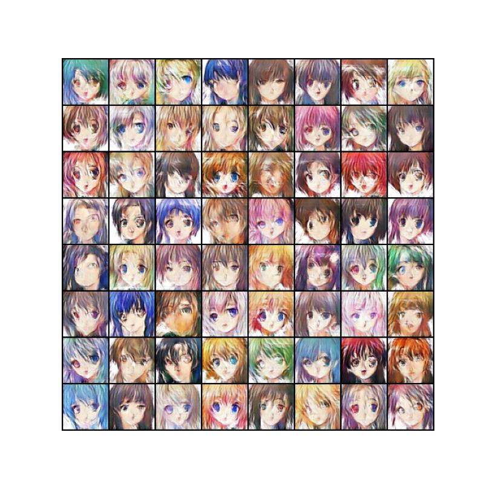
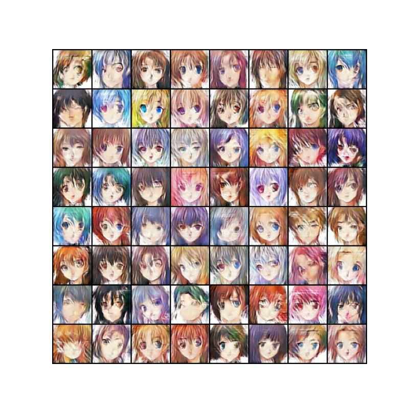
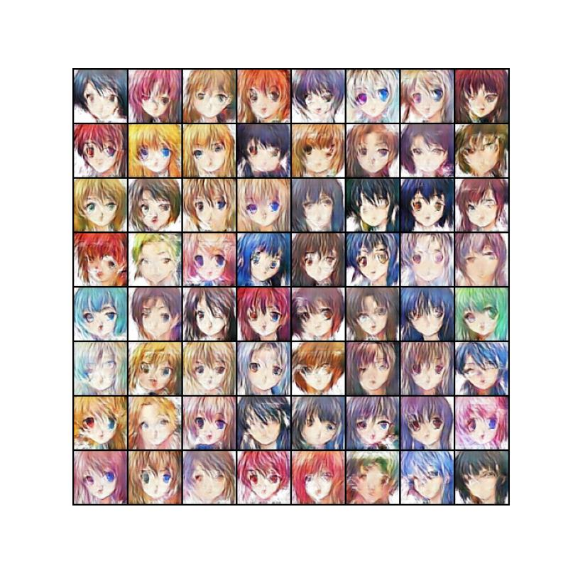

# AnimeGAN
simple GAN for generating (not so great) anime faces

## setup 
* Clone the repo and cd into it
```bash
git clone https://github.com/SkAndMl/anime-generator.git
cd anime-generator
```
* Create a virtual env using your favorite pkg manager. Just providing an example here
```bash
python -m venv venv
source venv/bin/activate
pip install -r requirements.txt
```

## training 
to train the model and store their weights run the following command
```bash
python train.py --cp_dir "checkpoints/animegan.pt"
```

## inference
to run inference on the model and save the image use the following command
```bash
python3.11 inference.py --bs 64 --img_path "parent_folder/example.jpg" --seed 1234 --cp_dir "checkpoints/animegan.pt"
```

## run the simple streamlit app to show off
```bash
streamlit run app.py
```

## examples


